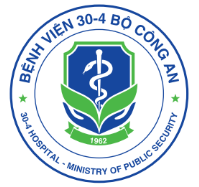

::: {.section-card}
## Đơn vị và nền tảng website

::: {.logo-grid}

::: {.logo-item}
{height=70}
**Bệnh viện 30-4**
:::

::: {.logo-item}
{height=70}
**Phòng khám Đông y Thùy Dương**
:::

::: {.logo-item}
{height=40}
Quarto
:::

::: {.logo-item}
{height=40}
R
:::

::: {.logo-item}
{height=40}
Posit / RStudio
:::

::: {.logo-item}
{height=40}
GitHub Pages
:::

:::

Website được xây dựng bằng **Quarto + R + Posit + GitHub Pages** để chia sẻ kiến thức Y học cổ truyền, thần kinh và sa sút trí tuệ.
:::